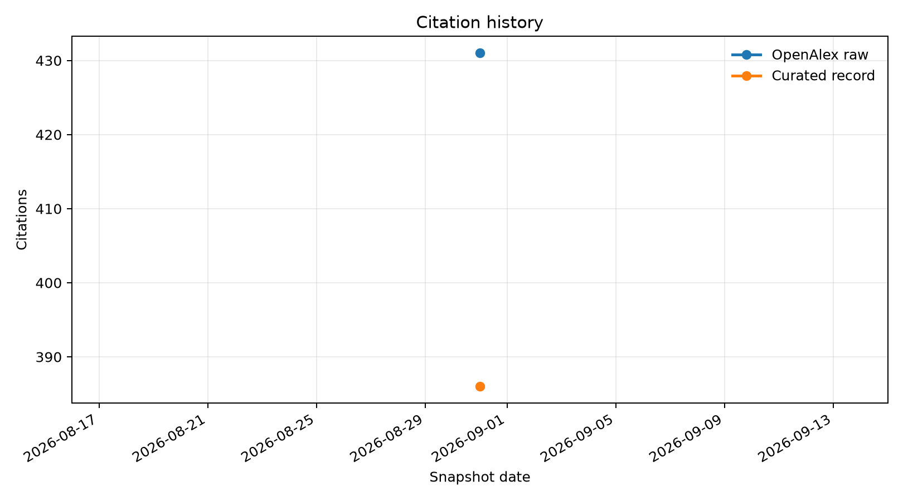
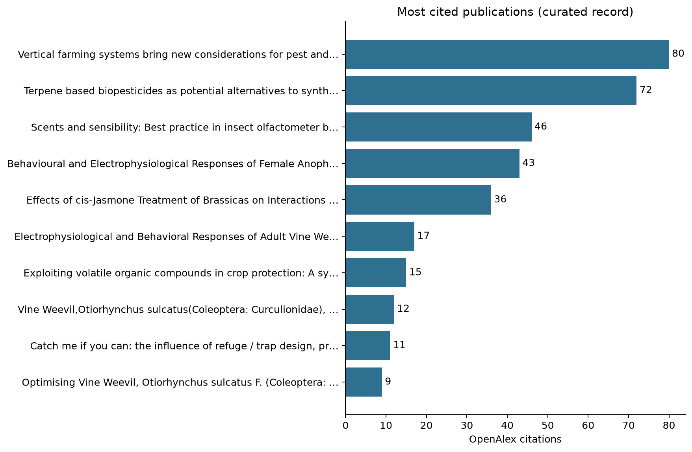

# OpenAlex Monitor

[](https://github.com/Dr-Joe-Roberts/openalex-monitor/actions/workflows/openalex-monitor.yml)

Reproducible monthly monitoring of [Joe M. Roberts's OpenAlex profile](https://openalex.org/A5060369592). The project records both the unmodified OpenAlex metrics and a curated view that removes confirmed author-disambiguation errors.

<!-- MONITOR:START -->
*Last updated: 2026-08-31T08:09:55 UTC*

| Metric | OpenAlex raw | Curated |
|---|---:|---:|
| Works | 54 | 50 |
| Citations | 431 | 386 |
| h-index | 11 | 9 |
| i10-index | 12 | 9 |

The curated view excludes 4 confirmed misattributions listed in [`config/author.json`](config/author.json). It does not automatically discard preprints or other legitimate versions.





### Most cited publications

| Rank | Publication | Year | Citations |
|---:|---|---:|---:|
| 1 | [Vertical farming systems bring new considerations for pest and disease management](https://openalex.org/W3007560514) | 2020 | 80 |
| 2 | [Terpene based biopesticides as potential alternatives to synthetic insecticides for control of aphid pests on protected ornamentals](https://openalex.org/W2802825342) | 2018 | 72 |
| 3 | [Scents and sensibility: Best practice in insect olfactometer bioassays](https://openalex.org/W4385308756) | 2023 | 46 |
| 4 | [Behavioural and Electrophysiological Responses of Female Anopheles gambiae Mosquitoes to Volatiles from a Mango Bait](https://openalex.org/W3016131663) | 2020 | 43 |
| 5 | [Effects of cis-Jasmone Treatment of Brassicas on Interactions With Myzus persicae Aphids and Their Parasitoid Diaeretiella rapae](https://openalex.org/W3204869631) | 2021 | 36 |
| 6 | [Electrophysiological and Behavioral Responses of Adult Vine Weevil, Otiorhynchus sulcatus (Coleoptera: Curculionidae), to Host Plant Odors](https://openalex.org/W2982285174) | 2019 | 17 |
| 7 | [Exploiting volatile organic compounds in crop protection: A systematic review of 1‐octen‐3‐ol and 3‐octanone](https://openalex.org/W4379209074) | 2023 | 15 |
| 8 | [Vine Weevil,Otiorhynchus sulcatus(Coleoptera: Curculionidae), Management: Current State and Future Perspectives](https://openalex.org/W4220832207) | 2022 | 12 |
| 9 | [Catch me if you can: the influence of refuge / trap design, previous feeding experience, and semiochemical lures on vine weevil (Coleoptera: Curculionidae) monitoring success](https://openalex.org/W2956372050) | 2019 | 11 |
| 10 | [Optimising Vine Weevil, Otiorhynchus sulcatus F. (Coleoptera: Curculionidae), Monitoring Tool Design](https://openalex.org/W4205464934) | 2022 | 9 |
<!-- MONITOR:END -->

## Outputs

- `data/metrics.csv` contains one profile-level observation per snapshot date.
- `data/papers.csv` contains the latest publication-level citation counts.
- `data/paper_history.csv` retains paper-level counts through time.
- `data/snapshots/` stores complete dated API responses for reproducibility.
- `plots/` contains figures regenerated during every update.
- `config/author.json` records the OpenAlex author ID and transparent exclusions.

## Schedule

GitHub Actions runs the monitor at **06:17 UTC on the first day of every month**. It can also be run manually from the Actions tab. When the API returns changed data, the workflow commits the new snapshot and regenerated outputs to `main`.

## Local use

```bash
python -m venv .venv
source .venv/bin/activate
pip install -r requirements.txt pytest
pytest -q
python monitor.py
```

The OpenAlex API does not require a login for this low-volume workflow. If an API key is added later, expose it through the optional `OPENALEX_API_KEY` environment variable; never commit it to the repository.

## Interpretation

Citation totals are specific to OpenAlex and should be reported with the database name and retrieval date. The curated metrics are calculated locally from the works retained in `config/author.json`; they do not change the public OpenAlex record.

## Licence

Code is released under the MIT Licence. OpenAlex data are provided under their applicable terms and licences.
