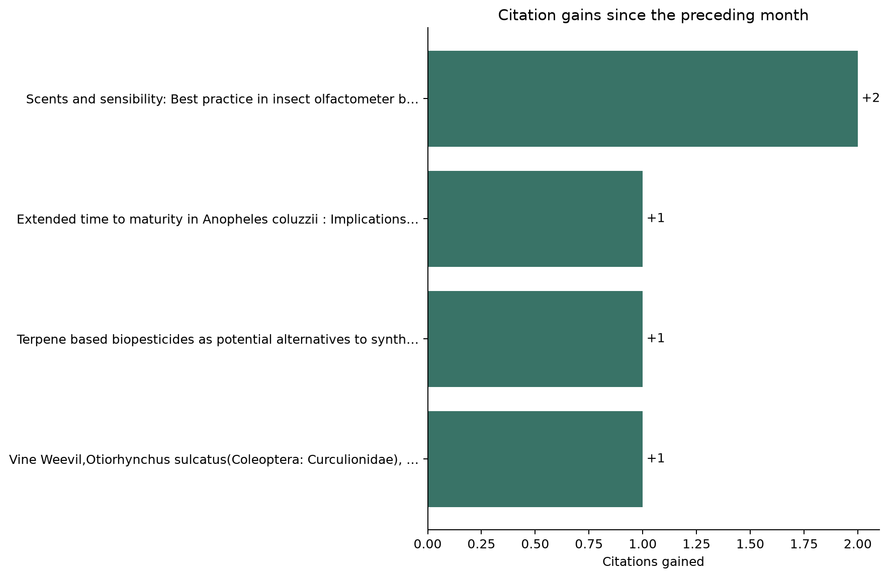
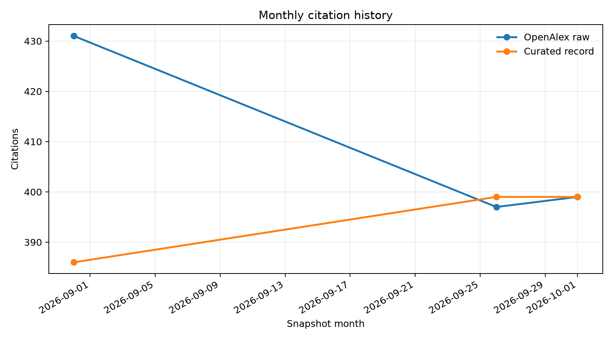

# OpenAlex Monthly Monitor

[](https://github.com/Dr-Joe-Roberts/openalex-monitor/actions/workflows/openalex-monitor.yml)

Tracks month-to-month changes in [Joe M. Roberts's OpenAlex record](https://openalex.org/A5060369592), including profile metrics, citation gains by publication and indexing changes.

<!-- MONITOR:START -->
## Latest snapshot

Retrieved **2026-09-11**; comparison: **2026-08-31**.

[Monthly report](reports/latest.md) · [Monthly JSON](data/monthly/2026-09.json) · [Full history](data/history.json)

| Metric | Curated | Change | OpenAlex raw | Raw change |
|---|---:|---:|---:|---:|
| Works | 46 | -4 | 46 | -8 |
| Citations | 389 | +3 | 389 | -42 |
| h-index | 9 | +0 | 9 | -2 |
| i10-index | 9 | +0 | 9 | -3 |

### Citation changes by publication

| Manuscript | Year | Previous | Current | Change |
|---|---:|---:|---:|---:|
| [Scents and sensibility: Best practice in insect olfactometer bioassays](https://openalex.org/W4385308756) | 2023 | 46 | 48 | +2 |
| [Extended time to maturity in Anopheles coluzzii : Implications of late egg hatch for vector control and transgene fitness](https://openalex.org/W4411090753) | 2025 | 0 | 1 | +1 |
| [Terpene based biopesticides as potential alternatives to synthetic insecticides for control of aphid pests on protected ornamentals](https://openalex.org/W2802825342) | 2018 | 72 | 73 | +1 |
| [Vine Weevil,Otiorhynchus sulcatus(Coleoptera: Curculionidae), Management: Current State and Future Perspectives](https://openalex.org/W4220832207) | 2022 | 12 | 13 | +1 |




<!-- MONITOR:END -->

## Archive

| Path | Contents |
|---|---|
| [`data/monthly/`](data/monthly) | Complete self-contained JSON record for each month |
| [`data/history.json`](data/history.json) | Compact longitudinal index of metrics and changes |
| [`reports/`](reports) | Human-readable monthly change reports |
| [`data/current.json`](data/current.json) | Latest complete record |
| [`data/snapshots/`](data/snapshots) | Dated reproducibility snapshots |

JSON is the primary archive; CSV files are retained for convenient analysis in R, Python and spreadsheets. See the [data guide](data/README.md) and [JSON schema](data/schema.json).

## Automation

The workflow runs at **06:17 UTC on the first day of every month** and can also be started from the [Actions page](https://github.com/Dr-Joe-Roberts/openalex-monitor/actions). Changed data, reports and figures are committed directly to `main`.

<details>
<summary>Run locally</summary>

```bash
python -m venv .venv
source .venv/bin/activate
pip install -r requirements.txt pytest
python -m pytest -q
python monitor.py
```

</details>

## Method

Raw metrics reproduce OpenAlex. Curated metrics exclude confirmed author-disambiguation errors listed in [`config/author.json`](config/author.json). Citation gains are calculated only for works present in consecutive monthly records; citations attached to newly indexed works are reported separately.

Code is released under the MIT Licence. OpenAlex data remain subject to their applicable terms and licences.
